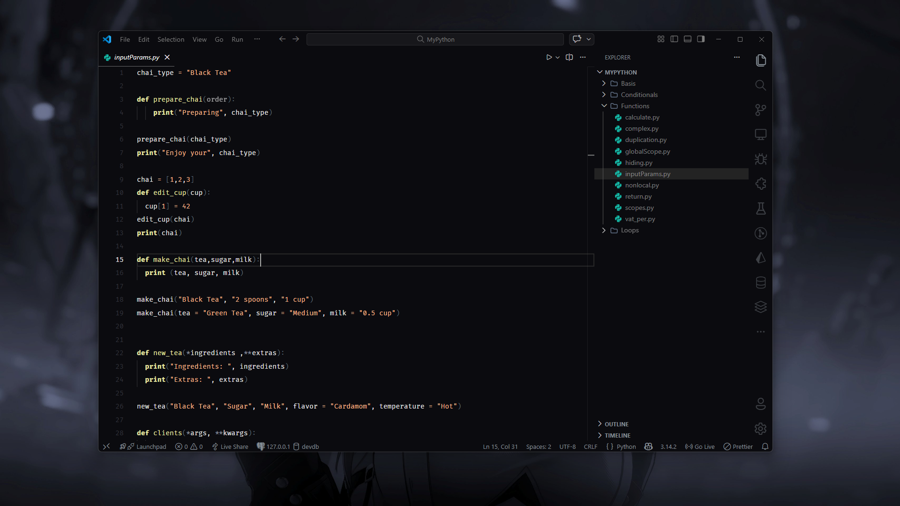
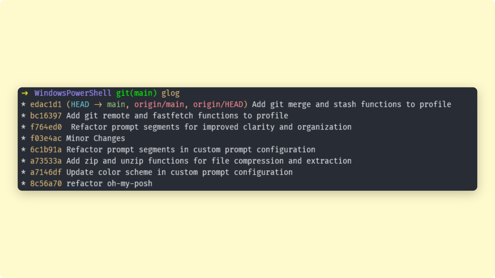

# PowerShell & VS Code Configuration

Streamlined PowerShell profile with Oh-My-Posh theming and custom shortcuts for Git, Bun, and file operations. Includes optimized VS Code settings.




## 🚀 Quick Setup

```powershell
# Copy files to PowerShell directory
cp *.ps1, custom.omp.json $HOME\Documents\WindowsPowerShell\

# Set execution policy if needed
Set-ExecutionPolicy RemoteSigned -Scope CurrentUser

# Reload profile
. $PROFILE
```

## 📦 Features

### PowerShell Profile

- **Oh-My-Posh**: Custom minimalist theme
- **PSReadLine**: Enhanced command-line editing
- **Shortcuts**: Git, Bun, Python, navigation, and file operations

### VS Code Settings

- **Theme**: Oscura Midnight with Fluent Icons
- **Font**: Fira Code with ligatures
- **Auto-formatting**: Prettier on save
- **Optimizations**: Disabled minimap, breadcrumbs; right sidebar


## 🎨 Required VS Code Extensions

Install these for full functionality:

- [Prettier](https://marketplace.visualstudio.com/items?itemName=esbenp.prettier-vscode) - Code formatter
- [Symbols](https://marketplace.visualstudio.com/items?itemName=miguelsolorio.symbols) - Icon theme
- [Fluent Icons](https://marketplace.visualstudio.com/items?itemName=miguelsolorio.fluent-icons) - Product icons
- [Oscura Midnight](https://marketplace.visualstudio.com/items?itemName=FarenAki.oscura-midnight) - Color theme

## 🛠️ Troubleshooting

**Profile not loading?**

```powershell
Get-ExecutionPolicy  # Should be RemoteSigned or Unrestricted
. $PROFILE           # Reload manually
```

**VS Code settings not applying?**  
Press `Ctrl+Shift+P` → "Developer: Reload Window"
